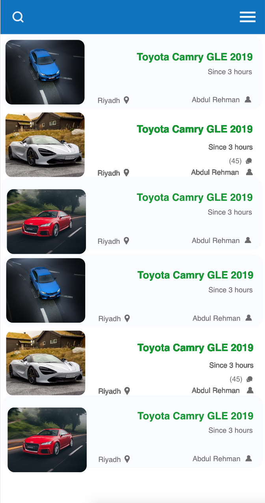
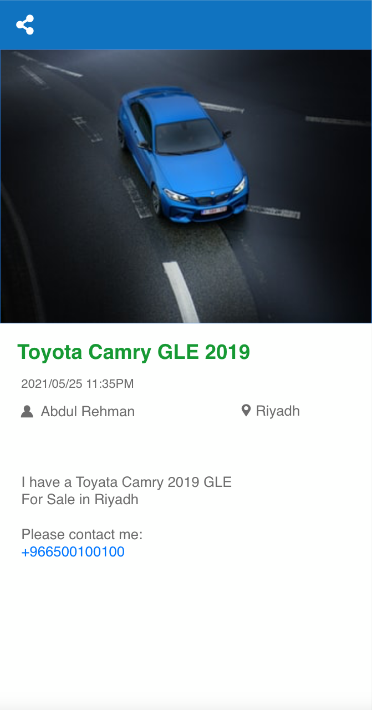

## Haraj Challenge

Project build using

Kotlin - First class and official programming language for Android development.

Coroutines - For asynchronous and more..

Architecture
Clean Architecture & 
MVVM pattern (View - DataBinding - ViewModel - Model)

Android Architecture Components - Collection of libraries that help you design robust, testable, and maintainable apps.

LiveData - Data objects that notify views when the underlying database changes.

ViewModel - Stores UI-related data that isn't destroyed on UI changes.

ViewBinding - Generates a binding class for each XML layout file present in that module and allows you to more easily write code that interacts with views.

Navigation - Android Jetpack's Navigation component refers to the interactions that allow users to navigate across, into, and back out from the different pieces of content within your app.

Dependency Injection
Hilt - Easier way to incorporate Dagger DI into Android apps. This is in the main branch.

Retrofit2 - constructing the REST API

OkHttp3 - implementing interceptor, logging and mocking web server

Glide - loading images.

Moshi - JSON representation

Timber - logging.

Material Components for Android - Modular and customizable Material Design UI components for Android.

Gradle Kotlin DSL - For writing Gradle build scripts using Kotlin.

Clean Architecture
Clean architecture promotes separation of concerns, making the code loosely coupled. This results in a more testable and flexible code. This approach divides the project in 3 modules: presentation, data and domain.

Presentation: Layer with the Android Framework, the MVVM pattern and the DI module. Depends on domain to access the use cases and on di, to inject dependencies.
Domain: Layer with the business logic. Contains the use cases, in charge of calling the correct repository or data member.
Data: Layer with the responsibility of selecting the proper data source for the domain layer. It contains the implementations of the repositories declared in the domain layer. It may, for example, check if the data in a database is up to date, and retrieve it from a service if it’s not.
As there isn’t a single way to implement Clean Architecture, this could affront changes in the future.

Domain
Business logic can be defined as the core operations done by the application. The domain tries to encapsulate this business logic, to make it agnostic of its context. The components of the domain are:

Entities: Simple classes that represent the objects in which the business is based.
Repositories: Interfaces used by the use cases. Implemented in the data layer.
Use cases: Also called interactors. They enclose a single action, like getting data from a database or posting to a service. They use the repositories to resolve the action they are supposed to do. They usually override the operator “invoke”, so they can be called as a function.
Data
The data layer is the implementation of all the repositories declared by the domain layer. This acts as a support of the business layer, from where it obtains the data needed to be shown in the UI.

Data is also an Android module so, besides databases and network requests, it can provide locations, bluetooth access, gyroscope data, among other information respective to the device. This could be separated in another module to provide independency from the framework.

It’s the repository job to know what should be the source of the data. The repository should decide whether the data in the local database is good enough or if it should pull it from a service. The repository shouldn’t be tied to an implementation of database/services. It should have references to interfaces that access the actual framework. A boolean may be passed as a parameter to the repository to force an update from a specific source.

Presentation
Presentation layer contains every component involved in showing information to the user. The main part of this layer are the Views and ViewModels that will be explained in the next section. In general, the presentation layer is the one using all the Use Cases/Interactors that we created in the domain layer.

Views in this layer are the fragments and activities designed to show information to the user. In MVVM, these views are separated from the logic, which is encapsulated in the ViewModel.

MVVM
The Model View ViewModel pattern helps with the separation of concerns, dividing the user interface with the logic behind. The decision to use this pattern is mainly based on the support Google has been giving to it. Not only they have created a ViewModel class to use as a parent to the viewmodels, there is also a huge use of the pattern in official Android presentations and samples. Moreover, MVVM is vastly used in today’s Android development, and combines very well with Android Architecture Components like LiveData and DataBindings.

Model
As we are implementing MVVM alongside with Clean Architecture, we decided not to have a model class per se. The ViewModel interacts directly with the domain, utilizing the use cases.

View Model
The orchestrator of the relationship between the data and the user interface of the application. The ViewModel has the logic to convert what the use cases provide into information that the view can understand and present. Furthermore, it has the logic to react to the user’s input, and call the pertinent use cases.

The most useful part of the Android’s ViewModel class is its lifecycle consciousness. It only communicates to the View with LiveData components, so it’s totally agnostic of contexts and activities: it can keep the information alive even against configuration changes like screen rotations or calls to background.

View
The view in our implementation of MVVM is actually a Fragment or an Activity. The views enclose everything needed to handle the user interface. They observe the ViewModel, using LiveData components, and react to its changes as they need to.

LiveData Architecture Component
The view uses LiveData to observe changes in the ViewModel. This has several advantages:

The UI matches the data state, and this keeps data up to date.
Not having to worry about stopped activities and memory leaks. Live data objects are subscript to a lifecycle and automatically stop observing when that lifecycle is ended.
Handles configuration changes properly.
The same data could be shared between activities.

Disclaimer
I've done my best to follow the principles of Clean Architecture and MVVM.
If you find any inconsistency with Clean Architecture feel free to open an issue.

Welcome to Haraj challenge!

In this repository you will find a sample app ready for implementation. 

You will find icons and a json file containing the data you'll need to complete this challenge.

## Your Mission

Create a functional app with two screens to display information about Posts from Haraj website.

First, a screen showing a list of Posts from the json file you'll find in `assets` folder.

Second, a screen that displays the information of a particular Post upon click events on the previous screen's list.

The share button should open up Android's native share sheet to share the title of the Post with other apps.

## Evaluation

Your work will be evaluated upon the following:
- Following common design patterns (preferably MVVM).
- Clean and testable code.
- Lightweight UI (avoid nested views)

## Submission
Fork this repository and share us the link to your fork after pushing the changes.
